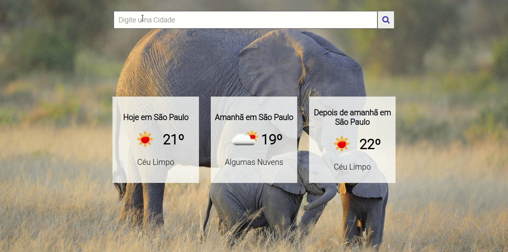
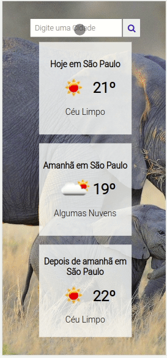

# Previsão do tempo

Este projeto de estudo que tem como objetivo permitir que o usuário pesquise sobre sua cidade e receba informações sobre o clima de "Hoje", "Amanhã" e "Depois de amanhã".


## Demonstração

Projeto temporariamente disponível em
[Netlify](https://luminous-beijinho-8044c9.netlify.app/)








## Rodando localmente

Clone o projeto

```bash
  git clone https://github.com/bellrodrigs/climate
```

Entre no diretório do projeto

```bash
  cd climate
```

Instale as dependências

```bash
  npm install
```

Inicie o servidor

```bash
  npm run dev
```

